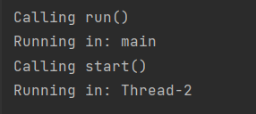

## 1. `start()` vs `run()`

```java  
public class StartVsRun {    
    static class MyRunnable implements Runnable {    
        public void run() {    
            System.out.println("Running in: " + Thread.currentThread().getName()); 
        }    
    }    
    public static void main(String[] args) throws InterruptedException {    
        Thread t1 = new Thread(new MyRunnable(), "Thread-1");    
        System.out.println("Calling run()");    
        t1.run();    
        Thread.sleep(100);    
    
        Thread t2 = new Thread(new MyRunnable(), "Thread-2");    
        System.out.println("Calling start()");    
        t2.start();    
    }  
}  
```  
***
**Questions:**


- What output do you get from the program? Why?
        
    

    ###    t1.run()

        *   Executes run() directly on the main thread
        *   It doesn’t create a new thread
    ###    t2.run()

        *   Creates a new thread(Thread-2)and executes run() in it
        *   The JVM handles the new thread by itself.


- What’s the difference in behavior between calling `start()` and `run()`?

    ### start()

    *  Creates a new thread
    *  Calls run() in new thread
    *  For  multithreading 

    ### run()

    *   Uses the current thread
    *   Executes like normal method call
    *   Run the thread directly


## 2. Daemon Threads

```java  
public class DaemonExample {    
    static class DaemonRunnable implements Runnable {    
        public void run() {    
            for(int i = 0; i < 20; i++) {    
                System.out.println("Daemon thread running...");    
                try {    
                    Thread.sleep(500);    
                } catch (InterruptedException e) {    
                 //[Handling Exception...]  
                }            
            }    
        }    
    }    
    public static void main(String[] args) {    
        Thread thread = new Thread(new DaemonRunnable());    
        thread.setDaemon(true);    
        thread.start();    
        System.out.println("Main thread ends.");    
    }  
}  
```  

**Questions:**
- What output do you get from the program? Why?

    

    *   The thread is set as a daemon using setDaemon(true)

    *   Daemon threads stop when the main program finishes

    *   The JVM exits without waiting for daemon threads to complete

- What happens if you remove `thread.setDaemon(true)`?

    *   The thread becomes a user thread

    *   The JVM waits for this thread to finish all 20 runs before closing

    *   Expect 20 'Daemon thread running...' prints before termination


- What are some real-life use cases of daemon threads?

    *   Garbage Collection

    *   Thread Pool Management

    *   Asynchronous I/O Operations      

  
---  

##   3. A shorter way to create threads

```java  
public class ThreadDemo {  
    public static void main(String[] args) {  
        Thread thread = new Thread(() -> {  
            System.out.println("Thread is running using a ...!");  
        });  
  
        thread.start();  
    }  
}   
```  

**Questions:**
- What output do you get from the program?

    

- What is the `() -> { ... }` syntax called?
    * Lambda 


- How is this code different from creating a class that extends `Thread` or implements `Runnable`?

    * #### extending `Thread`
        *   wastes inheritance

    *   ####    implements `Runnable` 
        *   Better for reusable/complex code
        


        

    